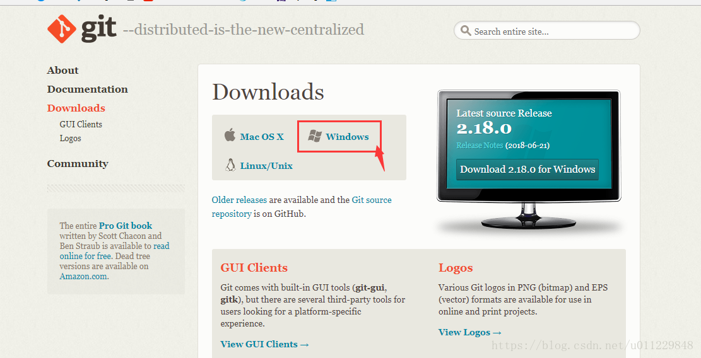
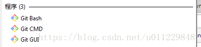
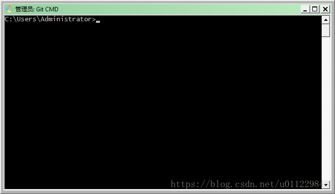

[文章来源:Git的最简单安装与配置](http://blog.csdn.net/u011229848/article/details/81626401)

进入下载页面：[https://www.git-scm.com/download/](https://www.git-scm.com/download/)

下载成功后点击运行文件一路默认安装，只需修改一下安装目录，详细安装见[https://blog.csdn.net/u013295518/article/details/78746007](https://blog.csdn.net/u013295518/article/details/78746007)

安装完成之后运行搜索git 显示：

点击Git CMD 弹出窗口：

# **简单配置**

很多博文中配置用户名是这样讲的。打开Git Bash 输入

git config --global user.name 'GitHub用户名'

git config --global user.email 'GitHub的邮箱'

如果你跟我一样遇到 fatal: not in a git directory

不妨打开Git CMD 试试

我在Git CMD中一步一步配置是没有问题的 ，简单配置就可以了，IDEA等工具可以使用了。