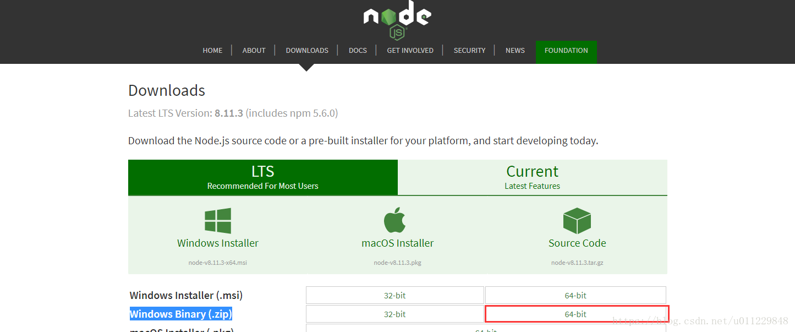
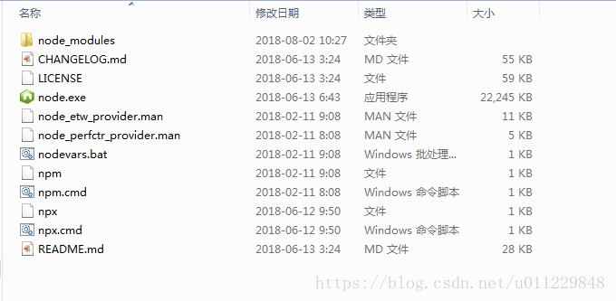
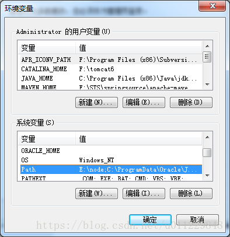
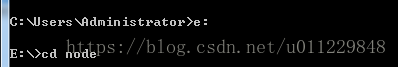
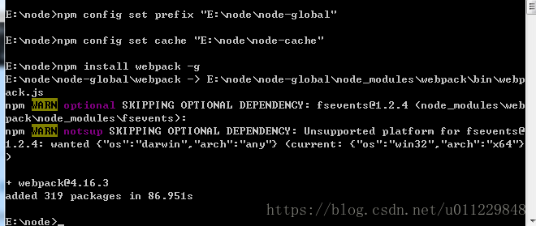
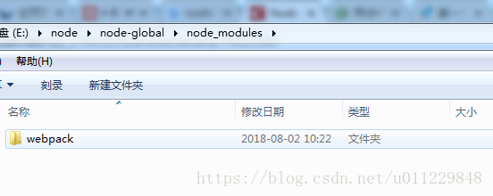

[文章来源:Node.js解压包安装与配置](http://blog.csdn.net//u011229848/article/details/81354074)

本文系转载：原文链接为：[https://my.oschina.net/zhzx/blog/1014764](https://my.oschina.net/zhzx/blog/1014764)

第一次接触node,希望能帮助到给我一样的小白

进入nodejs官网下载[https://nodejs.org/en/download/](https://nodejs.org/en/download/)，我自己下载的压缩包

下载后解压到电脑指定盘符，解压后文件夹目录为：

在目录下创建两个文件夹node-global（npm全局安装位置 ）和node-cache（npm 缓存路径 ），

将node.exe所在目录添加到path下

运行命令行，配置并下载

cmd 进入node所在目录

npm config set prefix “node-global路径”
npm config set cache “node-cache路径”

执行npm命令进行测试：npm install webpack -g
会发现node-global下node_modules中多了webpack 文件夹

webpack是用来打包的module，通常我们会在命令行中执行，而webpack同样在node-global中做了映射，所以只需要将node-global加入path环境变量即可。