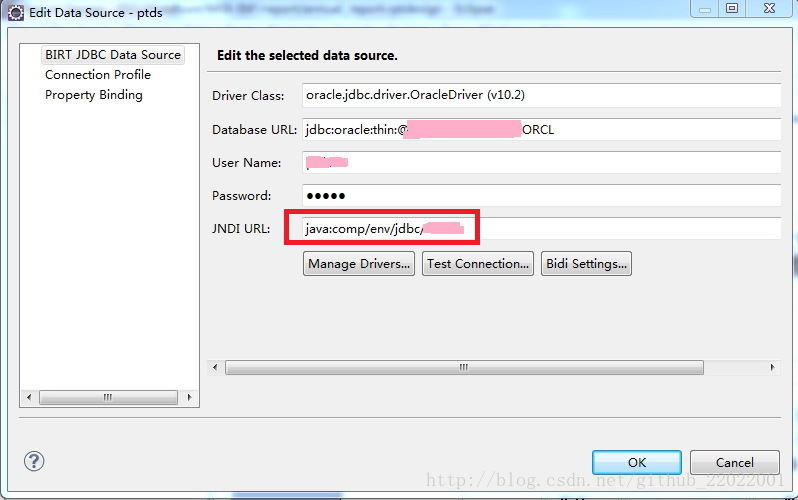

在使用birt做报表时，开发的时候用的一个数据源，测试的时候用到一个数据源，正式环境一个数据源，那每次都需要配置，然而birt提供了JNDI的方式即可解决配置数据源问题，
一旦项目运行后，首先回去找JNDI数据源，没有才连接配置的数据源，
JNDI配置三部曲：

1.在创建报表创建数据源时，配置JNDI URL

<!--more-->
2.Tomcat下\conf\context.xml中配置

```xml
<?xml version="1.0" encoding="UTF-8"?>
<Context>
 <Resource
      auth="Container"
      name="jdbc/xxx"
      type="javax.sql.DataSource"
      maxIdle="5"
      maxWait="-1"
         driverClassName="oracle.jdbc.driver.OracleDriver"
      username="xxx"
      password="xxx"
      url="jdbc:oracle:thin:@xxx.xxx.xxx.xxx:xxx:ORCL"
      maxActive="10"/>
</Context>
```
3.在项目/WEB-INF/web.xml增加代码
```xml
<resource-ref>
    <description>Database Source</description>
    <res-ref-name>jdbc/XXX</res-ref-name>
    <res-type>javax.sql.DataSource</res-type>
    <res-auth>Container</res-auth>
    </resource-ref>
```

配置就这么多