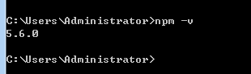
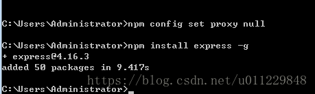

[文章来源:nodejs之NPM 使用介绍](http://blog.csdn.net//u011229848/article/details/81356897)


版权声明：本文为博主原创文章，未经博主允许不得转载。 https://blog.csdn.net/u011229848/article/details/81356897

本文系来自菜鸟教材：原文链接为：[https://www.runoob.com/nodejs/nodejs-npm.html](https://www.runoob.com/nodejs/nodejs-npm.html)

NPM是随同NodeJS一起安装的包管理工具，能解决NodeJS代码部署上的很多问题，常见的使用场景有以下几种：

* 允许用户从NPM服务器下载别人编写的第三方包到本地使用。
* 允许用户从NPM服务器下载并安装别人编写的命令行程序到本地使用。
* 允许用户将自己编写的包或命令行程序上传到NPM服务器供别人使用。
<!--more-->
由于新版的nodejs已经集成了npm，所以之前npm也一并安装好了。同样可以通过输入 **"npm -v"**来测试是否成功安装。命令如下，出现版本提示表示安装成功:



如果你安装的是旧版本的 npm，可以很容易得通过 npm 命令来升级，windows命令如下：

```npm install npm -g```

## 使用 npm 命令安装模块

npm 安装 Node.js 模块语法格式如下：
```
npm install <Module Name>
```
以下实例，我们使用 npm 命令安装常用的 Node.js web框架模块 **express**:
```
npm install express
```
安装好之后，express 包就放在了工程目录下的 node_modules 目录中，因此在代码中只需要通过 **require('express')** 的方式就好，无需指定第三方包路径。
```javascript
var express = require('express');
```


## 全局安装与本地安装

npm 的包安装分为本地安装（local）、全局安装（global）两种，从敲的命令行来看，差别只是有没有-g而已，比如
 ```
npm install express /# 本地安装 
npm install express -g /# 全局安装
```

如果出现以下错误：
```
npm err! Error: connect ECONNREFUSED 127.0.0.1:8087
```
解决办法为：
```
npm config set proxy null
```
### 本地安装

* 1. 将安装包放在 ./node_modules 下（运行 npm 命令时所在的目录），如果没有 node_modules 目录，会在当前执行 npm 命令的目录下生成 node_modules 目录。
* 2. 可以通过 require() 来引入本地安装的包。

### 全局安装

* 1. 将安装包放在 /usr/local 下或者你 node 的安装目录。
* 2. 可以直接在命令行里使用。

如果你希望具备两者功能，则需要在两个地方安装它或使用 **npm link**。

接下来我们使用全局方式安装 express
```
npm install express -g
```



### 查看安装信息

你可以使用以下命令来查看所有全局安装的模块：
npm list -g

## 使用 package.json

package.json 位于模块的目录下，用于定义包的属性。接下来让我们来看下 express 包的 package.json 文件，位于 node_modules/express/package.json 内容（不同版本的内容不太一样）：
```bash
    {
      "_from": "express",
      "_id": "express@4.16.3",
      "_inBundle": false,
      "_integrity": "sha1-avilAjUNsyRuzEvs9rWjTSL37VM=",
      "_location": "/express",
      "_phantomChildren": {},
      "_requested": {
        "type": "tag",
        "registry": true,
        "raw": "express",
        "name": "express",
        "escapedName": "express",
        "rawSpec": "",
        "saveSpec": null,
        "fetchSpec": "latest"
      },
      "_requiredBy": [
        "#USER"
      ],
      "_resolved": "https://registry.npmjs.org/express/-/express-4.16.3.tgz",
      "_shasum": "6af8a502350db3246ecc4becf6b5a34d22f7ed53",
      "_spec": "express",
      "_where": "C:\\Users\\Administrator",
      "author": {
        "name": "TJ Holowaychuk",
        "email": "tj@vision-media.ca"
      },
      "bugs": {
        "url": "https://github.com/expressjs/express/issues"
      },
      "bundleDependencies": false,
      "contributors": [
        {
          "name": "Aaron Heckmann",
          "email": "aaron.heckmann+github@gmail.com"
        },
        {
          "name": "Ciaran Jessup",
          "email": "ciaranj@gmail.com"
        },
        {
          "name": "Douglas Christopher Wilson",
          "email": "doug@somethingdoug.com"
        },
        {
          "name": "Guillermo Rauch",
          "email": "rauchg@gmail.com"
        },
        {
          "name": "Jonathan Ong",
          "email": "me@jongleberry.com"
        },
        {
          "name": "Roman Shtylman",
          "email": "shtylman+expressjs@gmail.com"
        },
        {
          "name": "Young Jae Sim",
          "email": "hanul@hanul.me"
        }
      ],
      "dependencies": {
        "accepts": "~1.3.5",
        "array-flatten": "1.1.1",
        "body-parser": "1.18.2",
        "content-disposition": "0.5.2",
        "content-type": "~1.0.4",
        "cookie": "0.3.1",
        "cookie-signature": "1.0.6",
        "debug": "2.6.9",
        "depd": "~1.1.2",
        "encodeurl": "~1.0.2",
        "escape-html": "~1.0.3",
        "etag": "~1.8.1",
        "finalhandler": "1.1.1",
        "fresh": "0.5.2",
        "merge-descriptors": "1.0.1",
        "methods": "~1.1.2",
        "on-finished": "~2.3.0",
        "parseurl": "~1.3.2",
        "path-to-regexp": "0.1.7",
        "proxy-addr": "~2.0.3",
        "qs": "6.5.1",
        "range-parser": "~1.2.0",
        "safe-buffer": "5.1.1",
        "send": "0.16.2",
        "serve-static": "1.13.2",
        "setprototypeof": "1.1.0",
        "statuses": "~1.4.0",
        "type-is": "~1.6.16",
        "utils-merge": "1.0.1",
        "vary": "~1.1.2"
      },
      "deprecated": false,
      "description": "Fast, unopinionated, minimalist web framework",
      "devDependencies": {
        "after": "0.8.2",
        "connect-redis": "~2.4.1",
        "cookie-parser": "~1.4.3",
        "cookie-session": "1.3.2",
        "ejs": "2.5.7",
        "eslint": "2.13.1",
        "express-session": "1.15.6",
        "hbs": "4.0.1",
        "istanbul": "0.4.5",
        "marked": "0.3.17",
        "method-override": "2.3.10",
        "mocha": "3.5.3",
        "morgan": "1.9.0",
        "multiparty": "4.1.3",
        "pbkdf2-password": "1.2.1",
        "should": "13.2.1",
        "supertest": "1.2.0",
        "vhost": "~3.0.2"
      },
      "engines": {
        "node": ">= 0.10.0"
      },
      "files": [
        "LICENSE",
        "History.md",
        "Readme.md",
        "index.js",
        "lib/"
      ],
      "homepage": "http://expressjs.com/",
      "keywords": [
        "express",
        "framework",
        "sinatra",
        "web",
        "rest",
        "restful",
        "router",
        "app",
        "api"
      ],
      "license": "MIT",
      "name": "express",
      "repository": {
        "type": "git",
        "url": "git+https://github.com/expressjs/express.git"
      },
      "scripts": {
        "lint": "eslint .",
        "test": "mocha --require test/support/env --reporter spec --bail --check-leaks --no-exit test/ test/acceptance/",
        "test-ci": "istanbul cover node_modules/mocha/bin/_mocha --report lcovonly -- --require test/support/env --reporter spec --check-leaks --no-exit test/ test/acceptance/",
        "test-cov": "istanbul cover node_modules/mocha/bin/_mocha -- --require test/support/env --reporter dot --check-leaks --no-exit test/ test/acceptance/",
        "test-tap": "mocha --require test/support/env --reporter tap --check-leaks --no-exit test/ test/acceptance/"
      },
      "version": "4.16.3"
    }

```

### Package.json 属性说明

* **name** - 包名。
* **version** - 包的版本号。
* **description** - 包的描述。
* **homepage** - 包的官网 url 。
* **author** - 包的作者姓名。
* **contributors** - 包的其他贡献者姓名。
* **dependencies** - 依赖包列表。如果依赖包没有安装，npm 会自动将依赖包安装在 node_module 目录下。
* **repository** - 包代码存放的地方的类型，可以是 git 或 svn，git 可在 Github 上。
* **main** - main 字段指定了程序的主入口文件，require('moduleName') 就会加载这个文件。这个字段的默认值是模块根目录下面的 index.js。
* **keywords** - 关键字

## NPM 常用命令

除了本章介绍的部分外，NPM还提供了很多功能，package.json里也有很多其它有用的字段。

除了可以在[npmjs.org/doc/](https://npmjs.org/doc/)查看官方文档外，这里再介绍一些NPM常用命令。

NPM提供了很多命令，例如install和publish，使用npm help可查看所有命令。

* NPM提供了很多命令，例如

install
和

publish
，使用

npm help
可查看所有命令。
* 使用

npm help <command>
可查看某条命令的详细帮助，例如

npm help install
。
* 在

package.json
所在目录下使用

npm install . -g
可先在本地安装当前命令行程序，可用于发布前的本地测试。
* 使用

npm update <package>
可以把当前目录下

node_modules
子目录里边的对应模块更新至最新版本。
* 使用

npm update <package> -g
可以把全局安装的对应命令行程序更新至最新版。
* 使用

npm cache clear
可以清空NPM本地缓存，用于对付使用相同版本号发布新版本代码的人。
* 使用

npm unpublish <package>@<version>
可以撤销发布自己发布过的某个版本代码。

## 使用淘宝 NPM 镜像

大家都知道国内直接使用 npm 的官方镜像是非常慢的，这里推荐使用淘宝 NPM 镜像。

淘宝 NPM 镜像是一个完整 npmjs.org 镜像，你可以用此代替官方版本(只读)，同步频率目前为 10分钟 一次以保证尽量与官方服务同步。

你可以使用淘宝定制的 cnpm (gzip 压缩支持) 命令行工具代替默认的 npm:
```
npm install -g cnpm --registry=https://registry.npm.taobao.org
```

这样就可以使用 cnpm 命令来安装模块了：
```
cnpm install [name]
```