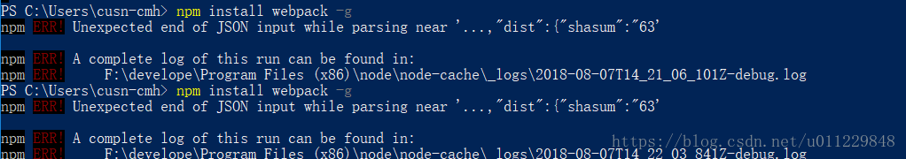

[文章来源:npm ERR! Unexpected end of JSON input while parsing near '](http://blog.csdn.net/u011229848/article/details/81490060)


**执行npm cache clean --force 即可解决npm install出现”Unexpected end of JSON input while parsing near”错误。**

之前用node没问题，突然NPM出现错误，今晚安装webpack 我停止之后再次安装出现

npm ERR! Unexpected end of JSON input while parsing near '...,"dist":{"shasum":"63'



执行
```
npm cache clean --force
```


即可解决npm install出现”Unexpected end of JSON input while parsing near”错误。

文章参考来源：[https://blog.csdn.net/wyhux/article/details/78041513](https://blog.csdn.net/wyhux/article/details/78041513)

以上是个人操作。网上具体操作如下：

1、如果你的项目里存在 package-lock.json 文件，删除它。并且删除 node_modules。然后再 npm install。

2、第一步不行的话。运行 npm cache clean --force 或者 npm cache verify 。然后再 npm install。

3、如果上面的都不行，就升级 npm 。 npm i -g npm