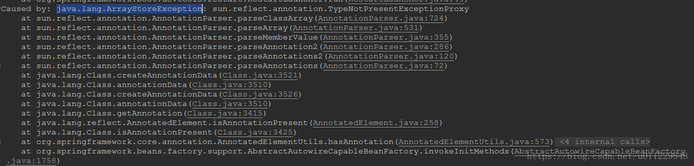
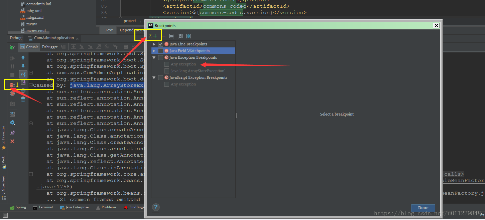
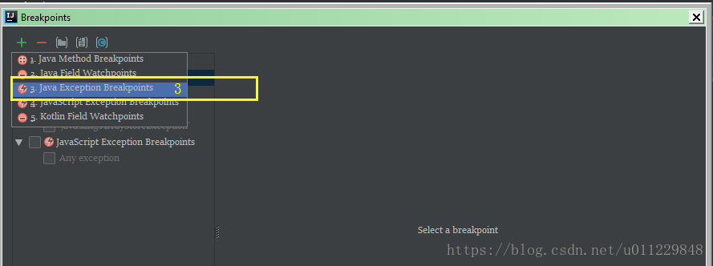
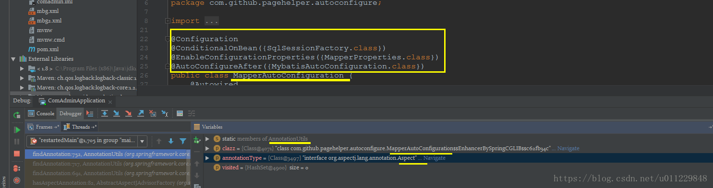
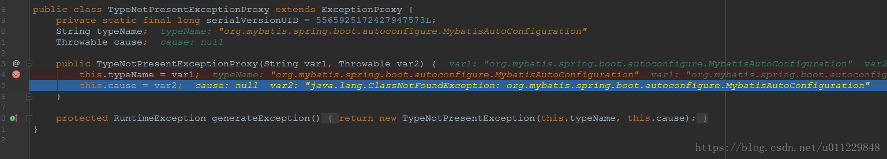
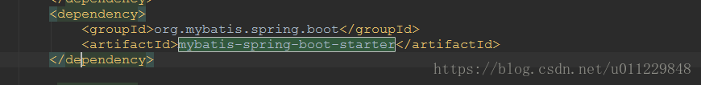

[文章来源:springboot 解决java.lang.ArrayStoreException](http://blog.csdn.net/u011229848/article/details/81567223)

版权声明：本文为博主原创文章，未经博主允许不得转载。 https://blog.csdn.net/u011229848/article/details/81567223

idea工具使用 Java Exception Breakpoint 添加异常断点，在IDE里，新建一个断点，类型是

<!--more-->
Java Exception Breakpoint

**当断点起效时，查看

AnnotationUtils.findAnnotation(Class<?>, Class<A>, Set<Annotation>) line: 686
函数的参数。**

**可以发现**

* **clazz是

class com.github.pagehelper.autoconfigure.MapperAutoConfiguration$$EnhancerBySpringCGLIB$$c62fb34c
**
* **annotationType是

interface org.aspectj.lang.annotation.Aspect
**

**说明是尝试从

MapperAutoConfiguration
里查找

@Aspect
信息时出错的。**

**
MapperAutoConfiguration
里确实没有

@Aspect，
但是为什么抛出

java.lang.ArrayStoreException。
**

**
更糟糕的是MapperAutoConfiguration 是源码包中的。
**

**
接着往下再看。。。
**

**没办法，只能在异常类里面打断点看，异常是java.lang.ArrayStoreException: sun.reflect.annotation.TypeNotPresentExceptionProxy，那就在TypeNotPresentExceptionProxy构造中打断点**

**一看这恍惚明白了什么**，**java.lang.ClassNotFoundException: org.mybatis.spring.boot.autoconfigure.MybatisAutoConfiguration**

查看之后发现pom里面没写版本号...

