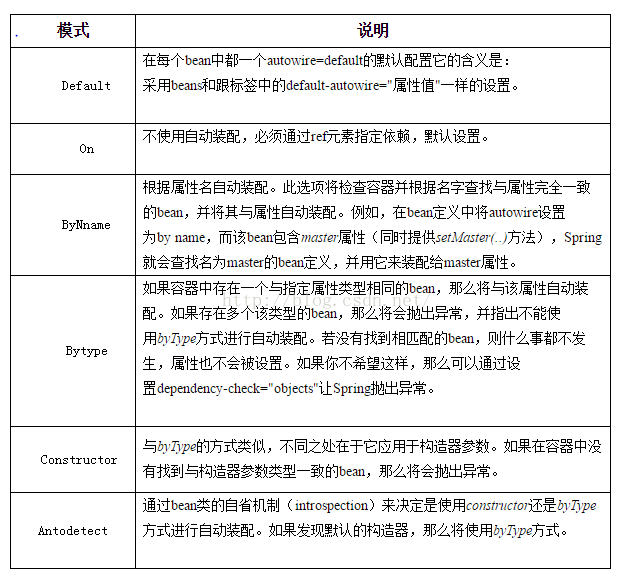

[文章来源:spring中bean的自动装配](http://blog.csdn.net/u011229848/article/details/52965926)


版权声明：本文为博主原创文章，未经博主允许不得转载。 https://blog.csdn.net/u011229848/article/details/52965926

spring中bean的自动装配的六种模式

Spring IoC容器可以自动装配（autowire）相互协作bean之间的关联关系。因此，如果可能的话，可以自动让Spring通过检查BeanFactory中的内容，来替我们指定bean的协作者（其他被依赖的bean）。autowire一共有六种类型。由于autowire可以针对单个bean进行设置，因此可以让有些bean使用autowire，有些bean不采用。autowire的方便之处在减少或者消除属性或构造器参数的设置，这样可以给我们的配置文件带来很多方便之处！


```xml
<?xml version="1.0" encoding="UTF-8"?>
<beans xmlns="http://www.springframework.org/schema/beans"
	xmlns:xsi="http://www.w3.org/2001/XMLSchema-instance"
	xmlns:context="http://www.springframework.org/schema/context"
	xsi:schemaLocation="http://www.springframework.org/schema/beans http://www.springframework.org/schema/beans/spring-beans.xsd
		http://www.springframework.org/schema/context http://www.springframework.org/schema/context/spring-context-4.0.xsd">

	<!-- 自动装配: 只声明 bean, 而把 bean 之间的关系交给 IOC 容器来完成 -->
	<!--  
		byType: 根据类型进行自动装配. 但要求 IOC 容器中只有一个类型对应的 bean, 若有多个则无法完成自动装配.
		byName: 若属性名和某一个 bean 的 id 名一致, 即可完成自动装配. 若没有 id 一致的, 则无法完成自动装配
	-->
	<!-- 在使用 XML 配置时, 自动转配用的不多. 但在基于 注解 的配置时, 自动装配使用的较多.  -->
	<bean id="dao" class="com.xiaoshu.spring.test.Dao">
		<property name="dataSource" value="C3P0"></property>				
	</bean>
	
	<!-- 默认情况下 bean 是单例的! -->
	<!-- 但有的时候, bean 就不能使单例的. 例如: Struts2 的 Action 就不是单例的! 可以通过 scope 属性来指定 bean 的作用域 -->
	<!--  
		prototype: 原型的. 每次调用 getBean 方法都会返回一个新的 bean. 且在第一次调用 getBean 方法时才创建实例
		singleton: 单例的. 每次调用 getBean 方法都会返回同一个 bean. 且在 IOC 容器初始化时即创建 bean 的实例. 默认值 
	-->
	<bean id="dao2" class="com.xiaoshu.spring.test.Dao" scope="prototype"></bean>
	
	<bean id="service" class="com.xiaoshu.spring.test.Service" autowire="byName"></bean>
	
	<bean id="action" class="com.xiaoshu.spring.test.Action" autowire="byType"></bean>

	<!-- 自动装配 采用constructor 构造器中的参数是按照byType进行装配的  -->
	<bean id="action2" class="com.xiaoshu.spring.test.Action" scope="singleton" autowire="constructor"/> 
</beans>
```