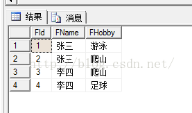
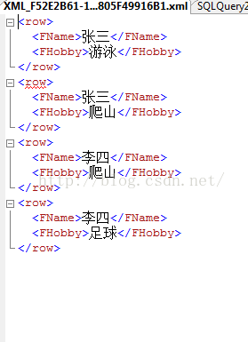
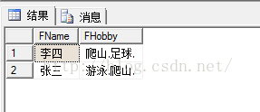

[文章来源:sqlserver中 多条数据合并成一条数据 （stuff 与 for xml path 连用）](http://blog.csdn.net/u011229848/article/details/49930229)

### [SQL Server 中的 STUFF 函数的使用]
STUFF ( character_1 , start , length ,character_2 )作用：将character_1中自start(SQL中都是从1开始，而非0)起，删除length个长度的字符，然后用character_2替换删掉的字符。

* character_1：一个字符数据表达式。character_1可以是常量、变量，也可以是字符列或二进制数据列。
* start：一个整数值，指定删除和插入的开始位置。如果 start或 length 为负，则返回空字符串。如果start比param1长，则返回空字符串。start可以是 bigint 类型。
* length：一个整数，指定要删除的字符数。如果 length 比character_1长，则最多删除到character_1 中的最后一个字符。length 可以是 bigint 类型。
* character_2,返回类型。如果character_1是受支持的字符数据类型，则返回字符数据。如果character_1是一个受支持的 binary 数据类型，则返回二进制数据。
实例：select STUFF('abcdefg',2,2,'1234') --结果为'a1234defg'

###

### [SQL Server 中的]for xml path

###

for xml path有的人可能知道有的人可能不知道，其实它就是将查询结果集以XML形式展现，有了它我们可以简化我们的查询语句实现一些以前可能需要借助函数活存储过程来完成的工作。那么以一个实例为主.

假设有个表存放着学生的兴趣爱好情况（）：

select * from Tu_User ;结果如下：

接下来我们来看应用FOR XML PATH的查询结果语句如下：
select FName,FHobby from Tu_User for xml path;

结果如下：

由此可以看出 FOR XML PATH 可以将查询结果根据行输出成XML格式！

SELECT B.FName,B.FHobby FROM ( SELECT FName, (SELECT FHobby+',' FROM Tu_User WHERE FName=A.FName FOR XML PATH('')) AS FHobby FROM Tu_User A GROUP BY FName ) B 
结果如下： 

 当然这样是通过子表的方式来查寻得到的结果，在项目中需要查的字段可能是十几个乃至几十个，这时候这样处理就不尽人意了，当然我也是从网上查找到别人的方法借鉴过来的，在这里就分享一下，希望大家看后多多批评指教： 
 这里呢就是将上述的两者相结合，  
 SELECT FName ,STUFF((SELECT FHobby+',' FROM Tu_User WHERE t_u.FName=FName order by FHobby FOR XML PATH('')),1,0,'') AS FHobby FROM Tu_User as t_uGROUP BY FName  
 结果如下：