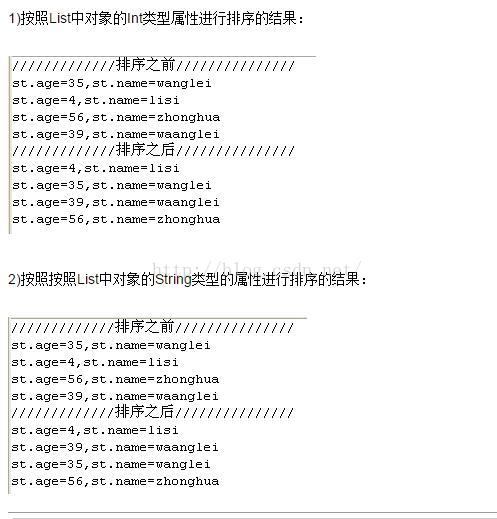

[文章来源:对List中的某个属性进行排序](http://blog.csdn.net/u011229848/article/details/51438275)


1.Student的Bean如下：
```java
public class Student {
       
       	private int age;
       	
       	private String name;
       	
       	private String weight;
       
       	public String getWeight() {
       		return weight;
       	}
       
       	public void setWeight(String weight) {
       		this.weight = weight;
       	}
       
       	public int getAge() {
       		return age;
       	}
       
       	public void setAge(int age) {
       		this.age = age;
       	}
       
       	public String getName() {
       		return name;
       	}
       
       	public void setName(String name) {
       		this.name = name;
       	}
       }
```
<!--more-->
2.按照List中对象的Int类型属性进行排序
```java
/**
 * 按照List中的某个Int类型的属性进行排序
 * @param list
 */
@SuppressWarnings("unchecked")
public static void sortIntMethod(List list){
    Collections.sort(list, new Comparator(){
        @Override
        public int compare(Object o1, Object o2) {
            Student stu1=(Student)o1;
            Student stu2=(Student)o2;
            if(stu1.getAge()>stu2.getAge()){
                return 1;
            }else if(stu1.getAge()==stu2.getAge()){
                return 0;
            }else{
                return -1;
            }
        }	    	
    });
    System.out.println("/////////////排序之后///////////////");
    for(int i=0;i<list.size();i++){
        Student st=(Student)list.get(i);
        System.out.println("st.age="+st.getAge()+",st.name="+st.getName());
    }
}
```
3.按照List中对象的String类型的属性进行排序
1)方法一：
```java
/**
 * 按照List中的某个String类型的属性进行排序
 * @param list
 */
@SuppressWarnings("unchecked")
public static void sortStringMethod(List list){
    Collections.sort(list, new Comparator(){
        @Override
        public int compare(Object o1, Object o2) {
            Student stu1=(Student)o1;
            Student stu2=(Student)o2;
            return stu1.getName().compareTo(stu2.getName());
        }	    	
    });
    System.out.println("/////////////排序之后///////////////");
    for(int i=0;i<list.size();i++){
        Student st=(Student)list.get(i);
        System.out.println("st.age="+st.getAge()+",st.name="+st.getName());
    }
}
```

2)方法二：
使用java.text.RuleBasedCollator来实现，用来执行区分语言环境的String 比较:
```java
/**
 * 按照List中的某个String类型的属性进行排序
 * @param list
 */
@SuppressWarnings("unchecked")
public static void sortByRuleBasedCollator(List list){
    Collections.sort(list, new Comparator(){
        @Override
        public int compare(Object o1, Object o2) {
            return ((java.text.RuleBasedCollator)java.text.Collator.getInstance(java.util.Locale.CHINA)).compare(((Student)o1).getName(), ((Student)o2).getName());
        }		
    });
    System.out.println("/////////////排序之后///////////////");
    for(int i=0;i<list.size();i++){
        Student st=(Student)list.get(i);
        System.out.println("st.age="+st.getAge()+",st.name="+st.getName());
    }
}
```
4.测试排序的方法
```java
@SuppressWarnings("unchecked")
public static void main(String[] args) {

    ArrayList list=new ArrayList();
    Student t1=new Student();
    t1.setAge(35);
    t1.setName("wanglei");
    list.add(t1);
    
    Student t2=new Student();
    t2.setAge(4);
    t2.setName("lisi");
    list.add(t2);
    
    Student t3=new Student();
    t3.setAge(56);
    t3.setName("zhonghua");
    list.add(t3);
    
    Student t4=new Student();
    t4.setAge(39);
    t4.setName("waanglei");
    list.add(t4);
    System.out.println("/////////////排序之前///////////////");
    for(int i=0;i<list.size();i++){
        Student st=(Student)list.get(i);
        System.out.println("st.age="+st.getAge()+",st.name="+st.getName());
    }
            //按照List中的某个Int类型的属性进行排序
    sortIntMethod(list);
    //按照List中的某个String类型的属性进行排序
    sortStringMethod(list);	
}
```
5.结果
