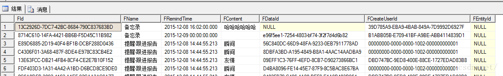
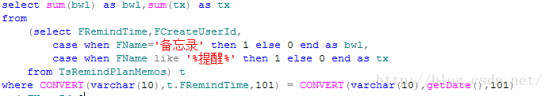
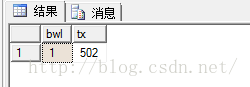

[文章来源:按条件分组统计信息](http://blog.csdn.net/u011229848/article/details/50235955)


版权声明：本文为博主原创文章，未经博主允许不得转载。 https://blog.csdn.net/u011229848/article/details/50235955

当你遇到统计不同条件下的信息数量时，为避免查询多次而组合的sql，可以参考如下：

提醒与备忘中的信息如下：

select /* from TsRemindPlanMemos



现在我需要统计出今天我分别有多少条备忘录与提醒

```sql
select sum(bwl) as bwl,sum(tx) as tx
from
(select FRemindTime,FCreateUserId,
case when FName='备忘录' then 1 else 0 end as bwl,
case when FName like '%提醒%' then 1 else 0 end as tx
from TsRemindPlanMemos) t
where CONVERT(varchar(10),t.FRemindTime,101) = CONVERT(varchar(10),getDate(),101)
and FUserId=?
```

谢谢，希望能有所帮助！